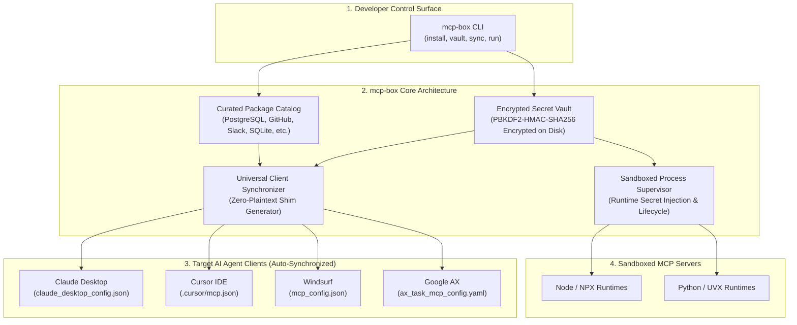
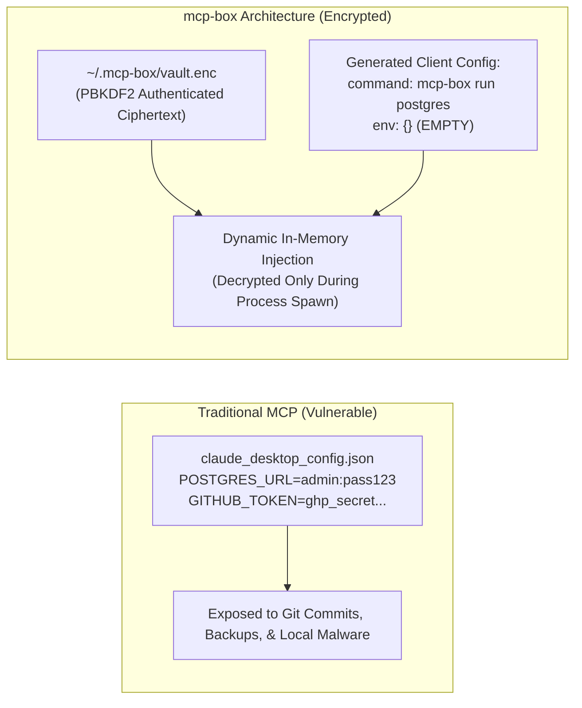

# 📦 mcp-box
> **Universal Package Manager, Encrypted Secret Vault & Sandboxed Runtime for Model Context Protocol (MCP)**

[](LICENSE)
[]()
[]()
[]()

`mcp-box` is the all-in-one developer tool for installing, managing, and securing Model Context Protocol (MCP) servers across all your AI agent clients. It eliminates manual JSON configuration and protects sensitive API tokens and database connection strings from being stored in **plaintext on disk**.

---

## The Problem: The MCP Configuration & Secret Leak Nightmare

With the rapid adoption of MCP across Claude Desktop, Cursor, Windsurf, and Google AX, developers face daily friction:
1. **Plaintext Secrets on Disk:** Database credentials (`postgres://...`) and GitHub tokens are copied into unencrypted JSON files in cleartext.
2. **Configuration Sprawl:** Setting up a new MCP server requires editing 4 different configuration formats across 4 directories.
3. **Broken Environments:** Node, NPX, Python, and UVX environments conflict and fail silently.

---

## High-Level System Architecture



---

## Encrypted Vault vs Plaintext Risk

Traditional MCP setups store sensitive credentials directly in configuration files. `mcp-box` ensures credentials **never hit disk in plain text**:



---

## Dynamic Runtime Shim Execution Flow

```mermaid
sequenceDiagram
    autonumber
    actor Developer as Developer / Agent
    participant Client as Claude Desktop / Cursor
    participant Shim as mcp-box Supervisor Shim
    participant Vault as Encrypted Secret Vault
    participant Server as MCP Server Process (Postgres / GitHub)

    Developer->>Client: "Query recent enterprise transactions"
    Client->>Shim: Spawns 'mcp-box run postgres' (Zero Plaintext Secrets)
    Shim->>Vault: Decrypt 'POSTGRES_CONNECTION_STRING' into Memory
    Vault-->>Shim: In-Memory Credentials Stream
    Shim->>Server: Spawns server process with isolated env variables
    Client<-->>Server: Standard JSON-RPC stdio tool execution
    Note over Client,Server: Client executes queries. Credentials never written to disk!
```

---

## Quickstart & CLI Usage

### 1. Run the End-to-End Demo
Demonstrates package exploration, local credential encryption, and multi-client configuration synchronization:

```bash
PYTHONPATH=projects python3 -m mcp_box.cli demo
```

Output:
```text
================================================================================
📦 MCP-BOX: UNIVERSAL PACKAGE MANAGER & ENCRYPTED VAULT FOR MCP
================================================================================

[Step 1] Browsing Curated MCP Package Catalog...
   • postgres        | Read/write PostgreSQL database access via MCP (Requires: POSTGRES_CONNECTION_STRING)
   • filesystem      | Secure local filesystem access with path whit (Zero Secrets)
   • github          | GitHub repos, issues, pull requests, and comm (Requires: GITHUB_PERSONAL_ACCESS_TOKEN)
   • slack           | Slack channel messaging and message history q (Requires: SLACK_BOT_TOKEN)
   • sqlite          | Local SQLite database query and schema explor (Zero Secrets)
   • brave-search    | Web and local search queries via Brave Search (Requires: BRAVE_API_KEY)

[Step 2] Storing Encrypted Credentials in Local Vault (Zero Plaintext)...
   Encrypted Secret Keys in Vault: ['GITHUB_PERSONAL_ACCESS_TOKEN', 'POSTGRES_CONNECTION_STRING', 'SLACK_BOT_TOKEN']
   Vault File on Disk: ./output_mcpbox/vault/vault.enc (Ciphertext Blob)

[Step 3] Universal Multi-Client Configuration Synchronization...
   ✅ Claude Desktop Config: ./output_mcpbox/claude_desktop_config.json (Protected by mcp-box vault shim)
   ✅ Cursor IDE Config:     ./output_mcpbox/cursor_mcp.json (Direct injection mode)
```

---

## CLI Reference

```bash
# List verified packages
mcp-box list

# Encrypt and store an API key
mcp-box vault set GITHUB_PERSONAL_ACCESS_TOKEN ghp_your_token_here

# Synchronize across Claude, Cursor, and Windsurf
mcp-box sync --clients claude,cursor,windsurf
```

---

## Running Test Suite

```bash
PYTHONPATH=projects python3 -m unittest discover -s projects/mcp_box/tests -v
```

```text
test_package_registry_catalog ... ok
test_supervisor_environment_resolution ... ok
test_universal_client_synchronization ... ok
test_vault_encryption_and_persistence ... ok

Ran 4 tests in 0.057s (OK)
```

---

## License
Apache-2.0
